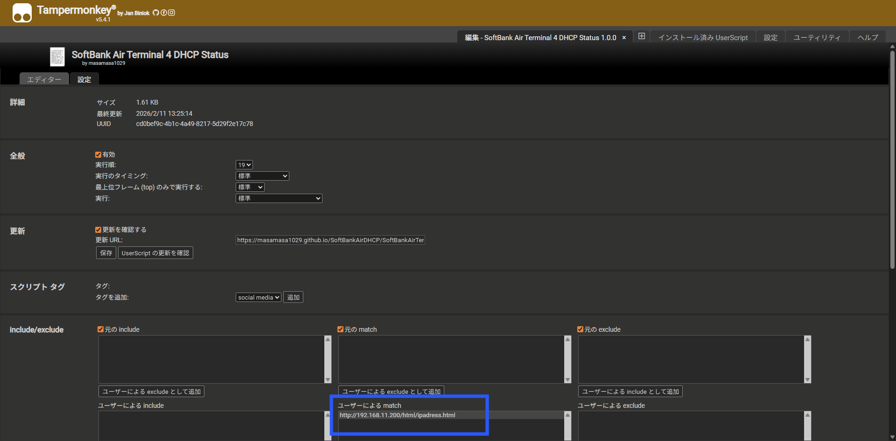
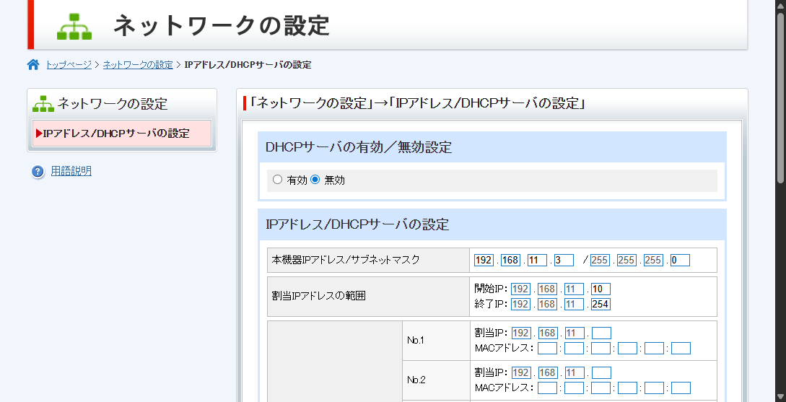

# SoftBankAirTerminal4DHCPStatus

Tampermonkey用のスクリプト  
SoftBank Air ターミナル4の管理画面に、DHCPサーバの有効／無効設定を追加する  
DHCPサーバを無効化すればアクセスポイントとして使用できる  

Airターミナル4NEXT(B610h-72a)で動作確認済み  
Airターミナル4(B610h-70a,B610h-71a)でも動くはず  

Airターミナル5以降はメーカーが違うため十中八九動かない  

※利用は自己責任でお願いします  

## インストール
インストール用リンク  
<https://masamasa1029.github.io/SoftBankAirDHCP/SoftBankAirTerminal4DHCPStatus.user.js>

Tampermonkeyへインストール後、[設定]タブの[ユーザーによるmatch]に下記URLを追加  
※IPアドレスは使用してるSoftBankAirのIPアドレスを設定  
>http://\*.\*.\*.\*/html/ipadress.html  

・設定例

## 画面サンプル

